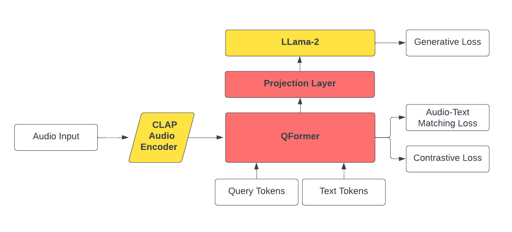

# Knowledge Graph Generation from Audio for Downstream NLP Tasks
Extracting structured graph representations from free-form data is a key problem in information extraction. Current state-of-the-art (SOTA) methods rely on rule-based or LLM backbone systems to create knowledge graphs from text data. We find that the audio domain is under-utilized, and most solutions simply transcribe audio to text before using familiar methods. Thus, we propose CLEO, a unified, end-to-end model that directly constructs knowledge graphs from audio streams for various downstream NLP tasks, such as misinformation detection. CLEO comprises a CLAP Audio Encoder as the starting point for audio input processing. The encoded audio undergoes a sequence of layers, including the QFormer, Projection Layer, and LLama-2-7B . To test our model's capability in misinformation detection, we use the PolitiFact Fact Check dataset. We convert written articles into graph representations and then assess the accuracy of new audio-based claims against these knowledge graphs. We believe our approach offers a promising direction on the issue of detecting misinformation from audio sources. By leveraging the structured representation of knowledge graphs, we aim to provide a tool that's both comprehensive and accurate in the fight against false information.

## Datasets
Our approach consists of two separate paradigms. The first is a training procedure to ensure that an LLM is amenable to audio samples as an input and is able to generate fluent text outputs with a specific prompt for downstream applications. The second is our use case of misinformation detection. In this work, we aimed to separate the pre-training procedure from the misinformation detection to ensure that our approach is compatible with multiple downstream applications other than just misinformation detection. Therefore, we leveraged two primary datasets to perform this work.

For the CLEO pre-training procedure, we leveraged the LibriSpeech dataset, which comes with 28,359 training samples containing high-quality audio recordings and text transcriptions. Each audio sample was recorded cleanly and, therefore, contains very little background noise. In future works, we aim to extend our methodology to include pre-processing to handle noise within audio systems.

We leveraged the Politifact misinformation detection dataset for our misinformation detection procedure. Because we are working with speech samples, we limited our dataset to only contain statements made in speeches, which provided us with 1,186 statements made in public. However, these statements were made in public using a text format. Therefore, we leveraged a pre-trained text-to-audio model, BARK, to create synthetic audio samples of the statements. Therefore, our misinformation dataset comprised synthetic audio statements, text statements, supporting information to validate or invalidate a statement, as well as the final verdict on whether a statement was misinformation or not.

## Overall Architecture
We leverage a frozen CLAP audio feature extractor model to extract audio features from an audio recording. These audio features are fed into a trained custom-trained QFormer model to bridge the divide between audio and textual embedding spaces. The QFormer model outputs were then projected onto the embedding space of a frozen LLama-2 model with a trained linear layer. The final textual outputs were then created using the LLama-2 model. The full architecture can be seen below:

## Run Information
Please ensure the following dependences are present prior to execution training scripts:
- The Llama-2-7b-hf model is placed within the models folder
- All of the data from [here](https://drive.google.com/drive/folders/1IOJK9t-DTel4gUKr1ff4Y4w-7kz8BFkP?usp=drive_link) and place the contents in the data folder

To train the CLEO model architecture E2E, please follow the following steps:
1. Execute the command: `python create_model_training_dataset.py`
2. Execute the command: `python train_cleoImagebind.py`

